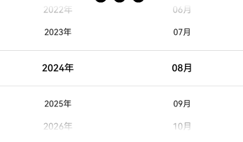
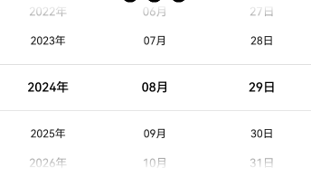
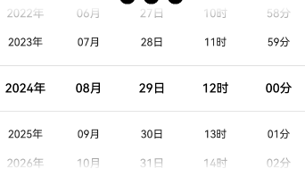
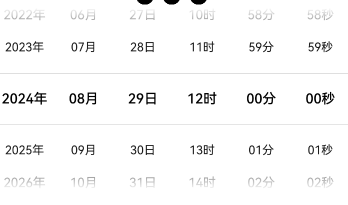
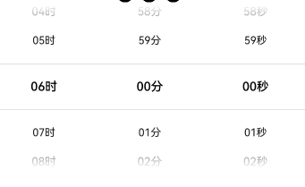
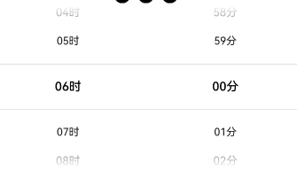
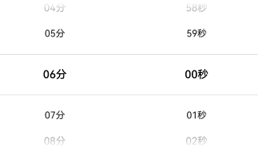

## 📚 简介 

oh-date-picker: openharmony & harmonyOS平台日期选择器增强版。  

代码仓库：[oh-date-picker](https://github.com/sahooz/oh-date-picker)

## 📚 下载安装

```shell
ohpm i @xinyansoft/oh-date-picker
```

OpenHarmony ohpm 环境配置等更多内容，请参考: [下载安装三方库](https://ohpm.openharmony.cn/#/cn/help/downloadandinstall)  

## 📚 效果图参考

### 年月



### 年月日



### 年月日时分



### 年月日时分秒



### 时分秒



### 时分



### 分秒



## 接口说明

```typescript
DateTimePicker({
    // 主要配置项
    config: {
      format: DateTimeFormat.YmdHm, // 时间格式
      start: '1900-01-01 00:00',  // 开始时间
      end: '2099-12-31 23:59', // 结束时间
      selected: DateUtil.getTodayStr('yyyy-MM-dd HH:mm') // 初始选中时间
    },
    // 后缀模式：独立和非独立模
    // 独立模式：后缀是独立的Text控件，不可滚动
    // 非独立模式：每个数据项都带有后缀，跟随数据项滚动
    suffixMode: SuffixMode.Together, 
    suffixes: {  // 后缀文字
      year: '年',
      month: '月',
      day: '日',
      hour: '时',
      minute: '分',
      second: '秒'
    },
    suffixTextStyle: { // 后缀文字样式，仅在后缀模式为独立模式时生效
      font: {
        size: 15
      },
      color: Color.Black
    },
    // 以下三个样式属性参见TextPicker
    selectedTextStyle: {
      font: {
        size: 15
      },
      color: Color.Black
    },
    disappearTextStyle: {
      font: {
        size: 13
      },
      color: Color.Black
    },
    textStyle: {
      font: {
        size: 13
      }
    },
    
    // 选择回调
    onSelectedCallback: (selected) => {
      this.selected = selected
    },
  
    // 循环模式：Auto，Enable，Disable
    // Auto: 数据项大于3项时可以滚动
    // Enable: 无论数据项多少都可以滚动
    // Disable: 无论数据项多少都不可以滚动
    loopMode: LoopMode.Auto
})
```

## 📚 使用示例   

```
import { DateTimeFormat, DateTimePicker, DateUtil, SuffixMode } from 'date-time-picker'
import { DateTime, DateTimePickerConfig } from 'date-time-picker/src/main/ets/components/DateTimePicker'

@Entry
@Component
struct Index {
  @State @Watch('conConfigChanged') config : DateTimePickerConfig = {
    format: DateTimeFormat.YmdHm,
    start: '1900-01-01 00:00',
    end: '2099-12-31 23:59',
    selected: DateUtil.getTodayStr('yyyy-MM-dd HH:mm')
  }
  @State suffixMode: SuffixMode = SuffixMode.Together
  @State selected: DateTime = new DateTime(this.config.format, this.config.selected)

  conConfigChanged() {
    this.selected = new DateTime(this.config.format, this.config.selected)
  }

  build() {
    Column() {
      DateTimePicker({
        config: this.config,
        suffixMode: this.suffixMode,
        selectedTextStyle: {
          font: {
            size: 15
          },
          color: Color.Black
        },
        textStyle: {
          font: {
            size: 13
          }
        },
        suffixTextStyle: {
          font: {
            size: 15
          },
          color: Color.Black
        },
        onSelectedCallback: (selected) => {
          this.selected = selected
        }
      }).width('100%')

      Blank()
      Text(`当前选择：${this.selected.format()}`)
      Blank()

      Row() {
        Button('年月', { type: ButtonType.Normal, stateEffect: true })
          .borderRadius(8)
          .backgroundColor(0x317aff)
          .width(90)
          .onClick(() => {
            this.config = {
              format : DateTimeFormat.Ym,
              start : '1900-08',
              end : '2100-08',
              selected : '2024-08'
            }
          })

        Button('年月日', { type: ButtonType.Normal, stateEffect: true })
          .borderRadius(8)
          .backgroundColor(0x317aff)
          .width(90)
          .onClick(() => {
            this.config = {
              format : DateTimeFormat.Ymd,
              start : '1900-08-29',
              end : '2100-08-29',
              selected : '2024-08-29'
            }
          })

        Button('年月日时分', { type: ButtonType.Normal, stateEffect: true })
          .borderRadius(8)
          .backgroundColor(0x317aff)
          .width(90)
          .onClick(() => {
            this.config = {
              format : DateTimeFormat.YmdHm,
              start : '1900-08-29 12:00',
              end : '2100-08-29 12:00',
              selected : '2024-08-29 12:00'
            }
          })
      }.width('100%')
      .height(52)
      .justifyContent(FlexAlign.SpaceAround)

      Row() {
        Button('年月日时分秒', { type: ButtonType.Normal, stateEffect: true })
          .borderRadius(8)
          .backgroundColor(0x317aff)
          .width(90)
          .onClick(() => {
            this.config = {
              format : DateTimeFormat.YmdHms,
              start : '1900-08-29 12:00:00',
              end : '2100-08-29 12:00:00',
              selected : '2024-08-29 12:00:00'
            }
          })
        Button('时分秒', { type: ButtonType.Normal, stateEffect: true })
          .borderRadius(8)
          .backgroundColor(0x317aff)
          .width(90)
          .onClick(() => {
            this.config = {
              format : DateTimeFormat.Hms,
              start : '00:00:00',
              end : '12:00:00',
              selected : '06:00:00'
            }
          })
        Button('时分', { type: ButtonType.Normal, stateEffect: true })
          .borderRadius(8)
          .backgroundColor(0x317aff)
          .width(90)
          .onClick(() => {
            this.config = {
              format : DateTimeFormat.Hm,
              start : '00:00',
              end : '12:00',
              selected : '06:00'
            }
          })
      }.width('100%')
      .height(52)
      .justifyContent(FlexAlign.SpaceAround)

      Row() {
        Button('分秒', { type: ButtonType.Normal, stateEffect: true })
          .borderRadius(8)
          .backgroundColor(0x317aff)
          .width(90)
          .onClick(() => {
            this.config = {
              format : DateTimeFormat.Ms,
              start : '00:00',
              end : '12:00',
              selected : '06:00'
            }
          })
        Button('后缀独立', { type: ButtonType.Normal, stateEffect: true })
          .borderRadius(8)
          .backgroundColor(0x317aff)
          .width(90)
          .onClick(() => {
            this.suffixMode = SuffixMode.Separated
          })
        Button('后缀非独立', { type: ButtonType.Normal, stateEffect: true })
          .borderRadius(8)
          .backgroundColor(0x317aff)
          .width(90)
          .onClick(() => {
            this.suffixMode = SuffixMode.Together
          })
      }.width('100%')
      .height(52)
      .justifyContent(FlexAlign.SpaceAround)

    }.width('100%')
    .height('100%')
  }
}
```
